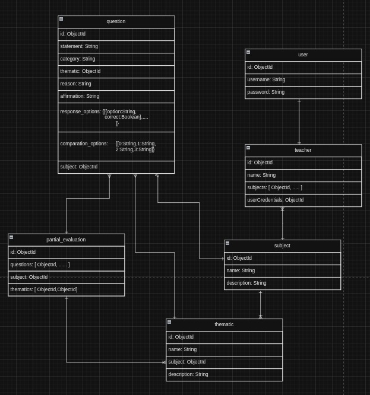

# Ejemplo en Redis
## Explicación de caso de uso

*El escenario de aplicación se centra en el desarrollo de un generador de exámenes parciales, el cual surge como resultado de la automatización del proceso de creación de evaluaciones parciales destinadas a profesores. Este innovador sistema tiene como objetivo facilitar y agilizar la labor docente al proporcionar una herramienta eficiente y personalizable que permita generar parciales de manera rápida y precisa, optimizando así el tiempo dedicado a la preparación de material evaluativo. Con esta solución automatizada, los educadores pueden enfocar su energía en actividades pedagógicas más significativas, mientras garantizan la calidad y relevancia de los exámenes parciales para evaluar el desempeño académico de los estudiantes.*

## Realización de ejemplo

### Parte 1 (Creación de tablas):

### Parte 2 (Inserción de datos (User, Teacher, Thematic y Subject)):

### Parte 3 (Inserción de datos (Question y partial_evaluation)):

